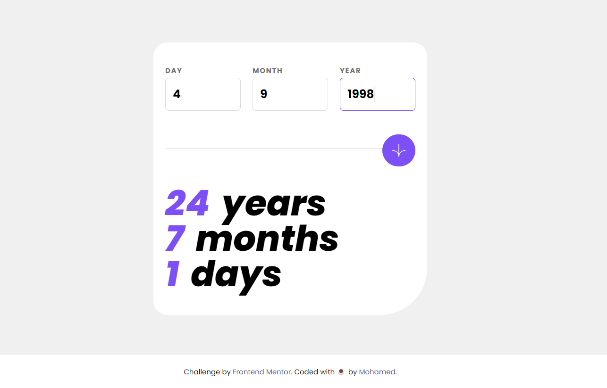

# Frontend Mentor - Age calculator app solution

This is a solution to the [Age calculator app challenge on Frontend Mentor](https://www.frontendmentor.io/challenges/age-calculator-app-dF9DFFpj-Q).

## Table of contents

- [Overview](#overview)
  - [The challenge](#the-challenge)
  - [Screenshot](#screenshot)
  - [Links](#links)
- [My process](#my-process)
  - [Built with](#built-with)
  - [Useful resources](#useful-resources)
- [Author](#author)

## Overview

### The challenge

Users should be able to:

- View an age in years, months, and days after submitting a valid date through the form
- Receive validation errors if:
  - Any field is empty when the form is submitted
  - The day number is not between 1-31
  - The month number is not between 1-12
  - The year is in the future
  - The date is invalid e.g. 31/04/1991 (there are 30 days in April)
- View the optimal layout for the interface depending on their device's screen size
- See hover and focus states for all interactive elements on the page
- **Bonus**: See the age numbers animate to their final number when the form is submitted

### Screenshot

### Links

- Solution URL: [Solution](https://your-solution-url.com)
- Live Site URL: [Live](https://m-age-calculator.netlify.app)

## My process

### Built with

- Semantic HTML5 markup
- Tailwind
- CSS Grid
- Mobile-first workflow
- Vanilla JavaScript

### Useful resources

- [stackoverflow get date](https://stackoverflow.com/questions/2013255/how-to-get-year-month-day-from-a-date-object) - helped me getting the year/month/day of the user input and how to calculate it

## Author

- Website - [Mohamed](https://mohamed-dev.netlify.app)
- Frontend Mentor - [@midoashraf010](https://www.frontendmentor.io/profile/midoashraf010)
- Twitter - [@\_gunblade6](https://www.twitter.com/_gunblade6)
